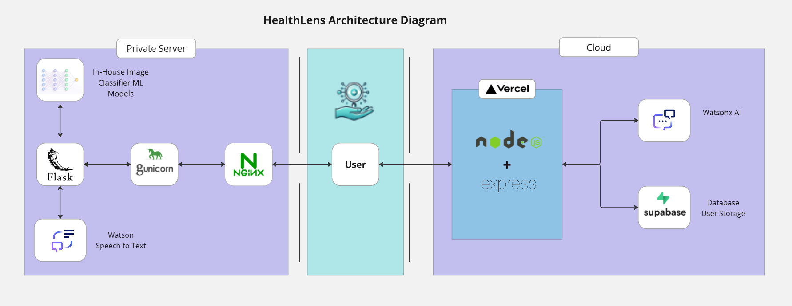
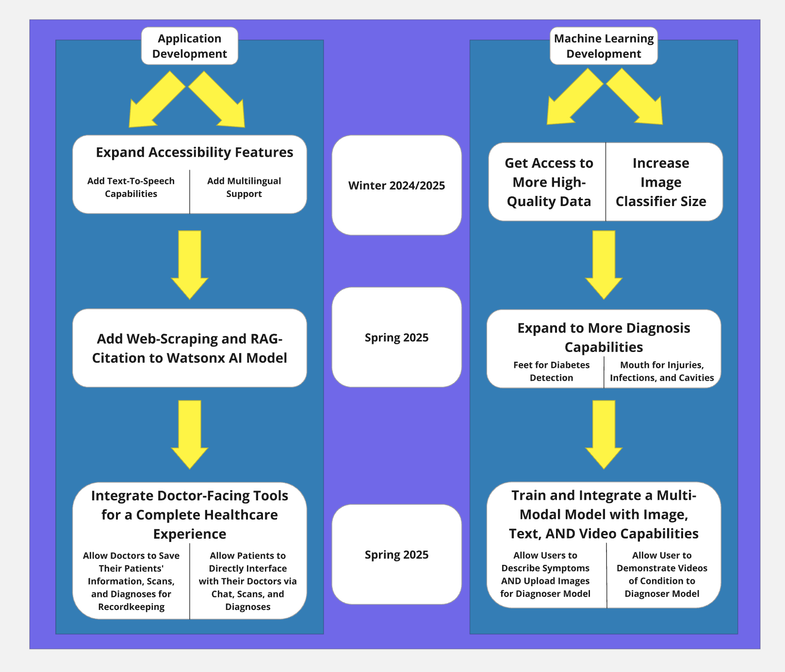

# HealthLens

- [Project summary](#project-summary)
  - [The issue we are hoping to solve](#the-issue-we-are-hoping-to-solve)
  - [How our technology solution can help](#how-our-technology-solution-can-help)
  - [Our idea](#our-idea)
  - [Important References](#important-references)
- [Technology implementation](#technology-implementation)
  - [IBM watsonx product used](#ibm-ai-services-used)
  - [Other IBM technology used](#other-ibm-technology-used)
  - [Solution architecture](#solution-architecture)
- [Presentation materials](#presentation-materials)
  - [Solution demo video](#solution-demo-video)
  - [Project development roadmap](#project-development-roadmap)
- [Additional details](#additional-details)
  - [How to run the project](#how-to-run-the-project)
  - [Live demo](#live-demo)
  - [License](#license)

## Project summary

### The issue we are hoping to solve

HealthLens addresses the stark disparity in access to medical diagnostics between developed and developing countries, where less than half of the global population has access to these vital, life-saving tools. Expensive medical diagnostic tests and equipment regularly puts people under the poverty line and adds undue stress to countless people throughout the world. HealthLens directly tackles the inequity in healthcare access, particularly in low- and middle-income countries where diagnostic availability is severely limited, especially at the primary care level.

### How our technology solution can help

HealthLens is a practical, powerful, AI-Driven, multi-class medical diagnoser.

### Our idea

Averages are deceptive numbers. On average, less than 10% of the communicable disease burden (malaria, cholera, HIV, etc.) in developed countries results from child mortality. If we change the scope, however, and focus our “average” to developing countries, we see that this number increases dramatically to 50%. On average, 74% of Europeans and Americans have access to necessary maternal medical intervention, whereas this number drops to 17% in the developing world. This disparity between “averages” is exacerbated when we look at access to medical diagnostics – the very tools that can detect diseases early before they become serious problems – as less than half of the world has access to these vital, life-saving tools. The importance of these diagnostics cannot be overstated, and their uneven distribution throughout the world only underscores the problem. We ought to focus on the only “average” that counts: the human average. 

Our solution, HealthLens, aims to weaken the disparity in access to medical diagnostics. The HealthLens application provides users with a practical, free, and easy-to-use image-based medical diagnostic tool that removes the need to spend large amounts of money on unequally distributed medical tests. With our desktop or mobile application, a user simply uploads an image of either their skin, eyes, and/or nails, and our four powerful AI medical image classification models return one of over forty different diagnoses and a confidence score that measures how confident our models are on their answers. We recognize, however, that a simple diagnosis isn’t enough; users need to be able to know what to do about their diagnosis, whether to seek a doctor, and what treatments are available. As such, HealthLens allows users to chat with a Watsonx-powered medical chatbot that specializes in their diagnoses – either by type questions or using our speech-to-text capability – answering any questions the user may have about their health. Additionally, if the condition identified warrants medical attention, a user can simply go to the HealthLens Doctor-Finder tool to locate a doctor relevant to their diagnoses near them and get their contact information to schedule an appointment. The vision we had for HealthLens was that of a health companion, not just a one-use tool; thus, we included the capability for users to save their data and receive email-reports regarding their diagnoses for personal recordkeeping or to show to their doctor. HealthLens reduces the pressure that the medical diagnostic access disparity places on the “human average” by reducing the process down to a free, easy-to-use app that simply needs an image to function.

While other image-based medical diagnostic tools exist, such as Firstderm’s AI Dermatology or DermDetect, HealthLens broadens the scope from just 7 skin-based diagnoses to over 40 diagnoses spanning the skin, eyes, and nails. Healthlens also has much more powerful models, being trained on over 12,000 images rather than the 700 images of the other models. Finally, Healthlens is much more than a simple diagnoser, our doctor-finding, encyclopedia, and chatbot capabilities provide a more complete experience than other existing solutions, providing the user a plan post-diagnosis as well, rather than just a simple diagnosis. 

Note: Our references are found in the `REFERENCES.md` page.

### Important References

Our project is currently live-deployed at [HealthLens](www.healthlens.app). Feel free to check it out!

This project was created using three repositories, each with their specific documentation. Here are the links to the other two: [backend](https://github.com/ericfly02/Backend-HealthLens) and [Flask service](https://github.com/ericfly02/Flask-Service-HealthLens)

The video accompanying our solution can be found [here](https://www.youtube.com/watch?v=AxZnPDS9ioE)

## Technology implementation

### IBM watsonx product(s) used

**Featured watsonx products**

- [watsonx.ai](https://www.ibm.com/products/watsonx-ai) - We incorporated this service by making calls to foundation models via Watsonx-AI. You can find its usage in our [backend repo](https://github.com/ericfly02/Backend-HealthLens) and in the `/frontend/src/components/Chat.tsx` file.

### Other IBM technology used

**Additional IBM AI services (Remove any that you did not use)**

- [Speech to Text](https://cloud.ibm.com/catalog/services/speech-to-text) - We incorporated this service by having IBM Speech to Text process our speech data and convert it into text for our chatbot to take in as input. You can find its usage in our [Flask Service Repo](https://github.com/ericfly02/Flask-Service-HealthLens) in the `app.py` file.

### Solution architecture

1. The user navigates to the site and uploads an image file.
2. Our NGINX engine sends it to gUnicorn and to our Flask Service to be processed by our Python-written in-house AI models. 
3. The Flask service provides an output and navigates via the Vercel Service to show the user the front-end results.
4. As shown by the diagram, the user's data is stored by our Supabase storage, our Watsonx-AI is served by Vercel, and our Watson-Speech-To-Text is serviced by our Flask Service.

## Presentation materials

### Solution demo video

Link to YouTube Demo video is [here](https://www.youtube.com/watch?v=AxZnPDS9ioE)

### Project development roadmap

The project currently does the following things.

- Classify over 40 different conditions via photos from the skin, eyes, and nails with sufficiently high accuracy
- Sends emails to users with important reports
- Has robust authentication
- Is connected to a Watsonx-AI foundation chatbot model with speech-to-text
- Has a robust doctor-finder tool that returns phone numbers and websites, if available
- Has an encyclopedia with all the diagnoses our bot can provide
- Has both web and mobile support
- Securely stores user data

In the future we plan to add to our project via two avenues: our application and our machine-learning (ML) models. Firstly, we plan on making the application itself more accessible by adding text-to-speech capabilities and multilingual support. IBM products will make this easy for us to implement in the future. Additionally we plan to strengthen our Watsonx-AI chatbot by adding RAG capabilities (we did not add this since it is a paid feature) and allowing the chatbot to return citations to the user from scraping the web so that the user can better trust the output of the chatbot. Finally, we plan on integrating doctor-facing tools so that patient and doctor can be connected through our HealthLens experience, such as allowing doctors themselves to save patient data and allowing patients to directly send information to their doctors from the HealthLens interface.

From the ML growth point-of-view, we plan on acquiring more high-quality data and more compute power so that we may train (on Watson ML/AutoAI) more powerful models that can classify even more diagnoses with a phone-camera image, such as pictures of the feet for diabetes detection or mouth pictures to detect infections or cavaties. We also aim to train and integrate a multi-modal ML pipeline so that a user may also describe their symptoms and even include videos to help the models better diagnose users. 

See below for our proposed schedule on next steps after Call for Code 2024 submission.

## Additional details

### How to run the project

In order to run this project locally, you must clone the other two repositories linked above in [this section](#important-references). Let us go step-by-step:

1. Flask: Create a virtual environment (`python -m venv venv`), run `pip install -r requirements.txt`, and run `python app.py`. Note some routes might have to be changed here to accommodate your specific server.

2. Frontend: Run `npm install`, `npm start`, change all the endpoints to service your specific needs, since we have our own specific endpoints: `https://www.healthlens.beauty/` is our flask localhost server, and `https://backend-health-lens.vercel.app/` is our nodejs localhost server

3. Backend: Run `npm install`, `npm run dev`. 

### Live demo

You can find a running system to test at [our app's site](www.healthlens.app)

---

### License

This project is licensed under the MIT License - see the [LICENSE](LICENSE.md) file for details.